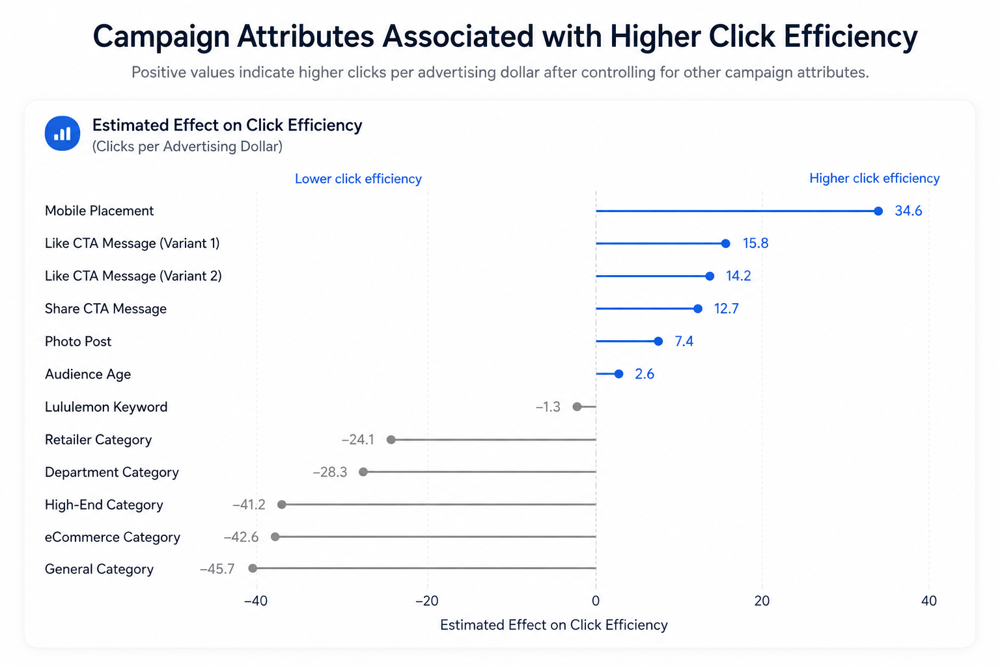
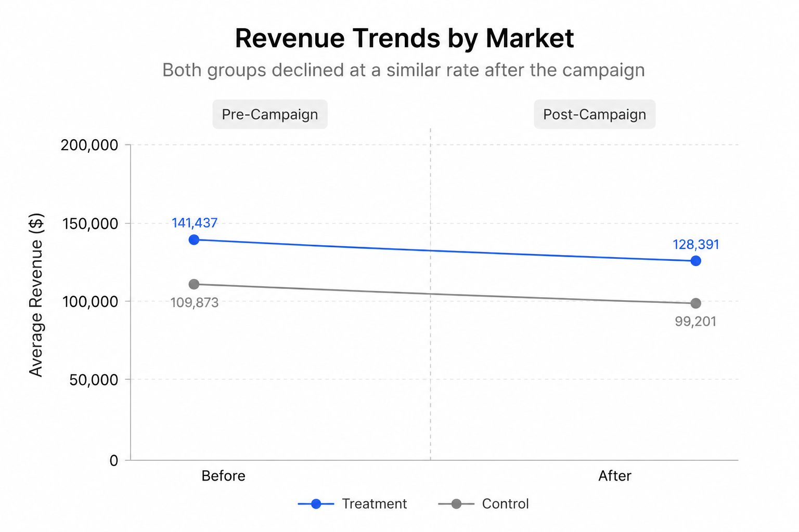
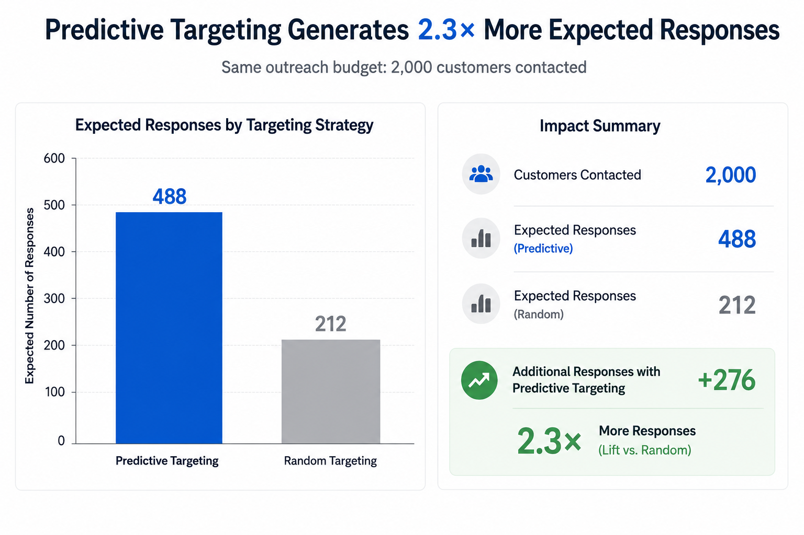

# Customer Growth Analytics

Three business analytics case studies answering the questions every marketing organization faces: **What drives performance? Did the investment work? Who should we target?**

Together, the projects cover the full analytics spectrum — descriptive analysis, causal inference, and predictive modeling — and show how each translates into a concrete business decision.

## What This Repository Demonstrates

| Capability | How It Shows Up Here |
|---|---|
| **Causal measurement** | Geo-experiment evaluation with Difference-in-Differences to separate campaign impact from market trends |
| **Predictive modeling** | Response-propensity model that turns probabilities into a customer targeting strategy |
| **Performance analysis** | Regression-based decomposition of what drives advertising efficiency across 4,400+ ads |
| **Decision translation** | Every project ends in a recommendation — including advising *against* scaling a campaign when the evidence didn't support it |

## Projects

| Project | Business Question | Methods | Key Result | Report |
|---|---|---|---|---|
| Advertising Performance Analysis | Which advertising strategies drive better campaign performance? | EDA, Multiple Linear Regression | Mobile placement associated with **+34.6 clicks per ad dollar** after controlling for other attributes | [View Report](#) |
| Marketing Incrementality | Did the campaign generate incremental sales? | Geo Experiment, Difference-in-Differences | **No significant lift detected** (p = 0.845) — recommended against scaling | [View Report](#) |
| Customer Response Prediction | Which customers are most likely to respond? | Logistic Regression, Decile Ranking, Targeting Simulation | **2.3× more expected responses** than random targeting at the same budget | [View Report](#) |

## Featured Projects

### 1 · Advertising Performance Analysis

Analyzed 4,431 Facebook ads to identify which campaign attributes are associated with higher click efficiency. After controlling for placement, format, creative message, retail category, and audience age in a multiple regression model, mobile placement (+34.6 clicks per dollar) and engagement-oriented CTA messages emerged as the strongest positive factors, while performance varied substantially across retail categories. Findings were translated into budget-allocation and creative-strategy recommendations.

<p align="center">
  
</p>

*Effects are estimated relative to baseline categories (e.g., Desktop Feed placement, Link Post format).*

### 2 · Marketing Incrementality Analysis

A retailer wanted to know whether its regional advertising campaign actually drove incremental revenue. Using data from a geo-based experiment, I validated pre-campaign balance between treatment and control markets, contrasted a naive before–after estimate with a Difference-in-Differences model, and found **no statistically significant incremental lift** (β = 0.007, p = 0.845). The analysis recommended against scaling the campaign — a reminder that the value of causal analysis often lies in preventing wasted spend, not just justifying it. The result independently reproduces the central finding of the well-known eBay paid search experiment (Blake, Nosko & Tadelis, 2015, *Econometrica*).

<p align="center">
  
</p>

### 3 · Customer Response Prediction

A bank wanted to improve the efficiency of its telemarketing campaigns. Using 41,188 historical campaign records, I built a logistic regression model to rank customers by their likelihood of subscribing to a term deposit — after first removing a data-leakage variable (call duration) that would not be known at decision time. The top prediction decile achieved a **38% actual response rate versus 3% in the bottom decile**, and a targeting simulation showed that contacting the top-ranked 2,000 customers would generate **2.3× more responses (488 vs. 212)** than random selection at the same outreach budget.

<p align="center">
  
</p>

## Analytics Workflow

Every project follows the same workflow: define the business problem → explore and prepare the data → build analytical models → evaluate results → generate business recommendations.

## Data Sources

- **Marketing Incrementality** uses data from the eBay paid search experiment (Blake, Nosko & Tadelis, 2015, *Econometrica*), adapted as a teaching case through graduate coursework. The analysis independently reproduces the paper's central finding of no significant incremental effect.
- **Customer Response Prediction** uses the UCI Bank Marketing dataset (Moro, Cortez & Rita, 2014).
- **Advertising Performance** uses a Facebook advertising dataset provided through graduate business analytics coursework at the University of Rochester.

These projects were developed as part of graduate coursework in business analytics; all analysis, modeling, and write-ups are my own.

## Tools & Technologies

- **Analysis & Modeling:** R (tidyverse, broom, pROC), Python, scikit-learn, pandas
- **Visualization:** ggplot2
- **Reporting:** Quarto, Jupyter Notebook

## Repository Structure

```
customer-growth-analytics/
├── data/        # Raw datasets
├── figures/     # Charts used in reports and README
├── notebooks/   # Analysis notebooks (one per project)
├── output/      # Rendered HTML reports
└── README.md
```

Analysis notebooks, figures, and generated reports are organized separately for reproducibility and easier navigation.
```
